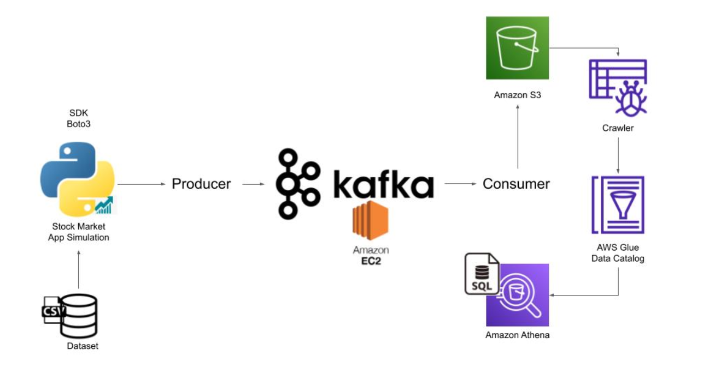

# Real-Time Stock Market Analysis using Kafka

## Introduction
This project provides a comprehensive guide to implementing an end-to-end data engineering solution for real-time stock market data using Apache Kafka. Through this project, you'll gain hands-on experience in processing and analyzing real-time data streams efficiently.

## Architecture

## Technologies Used
- **Programming Language**: Python
- **Amazon Web Services (AWS)**:
  1. S3 (Simple Storage Service)
  2. Athena
  3. Glue Crawler
  4. Glue Catalog
  5. EC2
- **Apache Kafka**

## Steps
1. Install Kafka [!kafka_installation](https://medium.com/@neupane.krishna33/how-to-install-apache-kafka-and-rsyslog-on-ubuntu-20-04-90fea750d8f5). Incase of insufficient pysical memory use swap memory. Here are the commands,  
"sudo fallocate -l 2G /swapfile 
sudo chmod 600 /swapfile 
sudo mkswap /swapfile 
sudo swapon /swapfile 
"

## Dataset
You have the flexibility to choose any dataset that suits your requirements. However, for demonstration purposes, we've provided a sample dataset to showcase the data pipeline building process.

