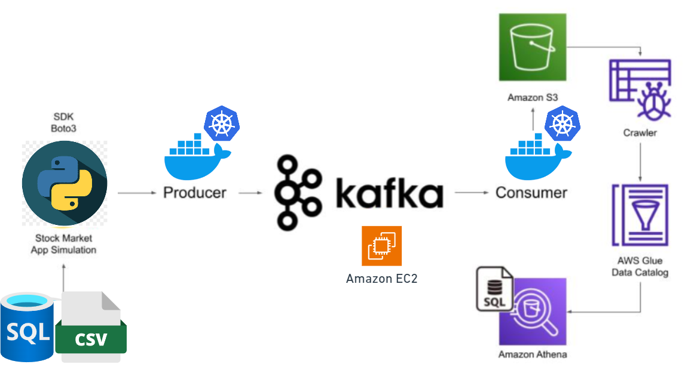
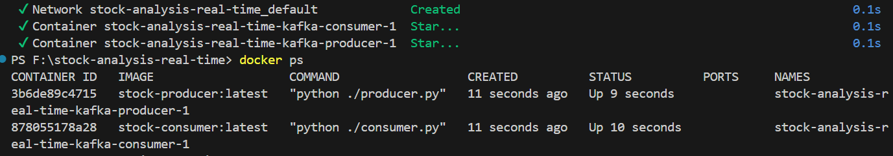

# Real-Time Stock Market Analysis using Kafka

This project offers a hands-on approach to building an end-to-end data engineering solution for processing real-time stock market data with Apache Kafka. By working through this project, you'll dive into the practical aspects of managing and analyzing data streams in real-time.

## Architecture


## Technologies Used
- **Programming Language**: Python
- **Amazon Web Services (AWS)**:
  1. S3 (Simple Storage Service)
  2. Athena
  3. Glue Crawler
  4. Glue Catalog
  5. EC2
- **Apache Kafka**

## Steps
1. Install Kafka [!kafka_installation](https://medium.com/@neupane.krishna33/how-to-install-apache-kafka-and-rsyslog-on-ubuntu-20-04-90fea750d8f5). Incase of insufficient pysical memory use swap memory. Here are the commands, <br>
export KAFKA_HEAP_OPTS="-Xmx512M -Xms512M"<br>
sudo fallocate -l 2G /swapfile<br>
sudo chmod 600 /swapfile<br>
sudo mkswap /swapfile<br>
sudo swapon /swapfile<br>
2. Make the space permanent -> echo '/swapfile none swap sw 0 0' | sudo tee -a /etc/fstab<br>
3. View the changes using -> sudo swapon --show and Restart kafka.<br>
4. Make sure to run zookeeper and kafka seperately using similar comand "bin/kafka-server-start.sh config/server.properties"<br>
5. Once kafka is running in EC2, it should have accept requests on public ip 35.172.219.231:9092

6. Up docker compose, it will run both producer and consumer (simulate env)


7. S3 bucket 

8. AWS athena live query 

9. use Terraform as IaC <br>


## Important Commands:

```
wget https://downloads.apache.org/kafka/3.3.1/kafka_2.12-3.3.1.tgz
tar -xvf kafka_2.12-3.3.1.tgz
bin/zookeeper-server-start.sh config/zookeeper.properties
export KAFKA_HEAP_OPTS="-Xmx256M -Xms128M"
bin/kafka-server-start.sh config/server.properties
sudo nano config/server.properties
bin/kafka-topics.sh --create --topic demo_testing2 --bootstrap-server {Put the Public IP of your EC2 Instance:9092} --replication-factor 1 --partitions 1
bin/kafka-console-producer.sh --topic demo_testing2 --bootstrap-server {Put the Public IP of your EC2 Instance:9092}
bin/kafka-console-consumer.sh --topic demo_testing2 --bootstrap-server {Put the Public IP of your EC2 Instance:9092}
```
